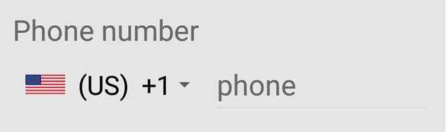
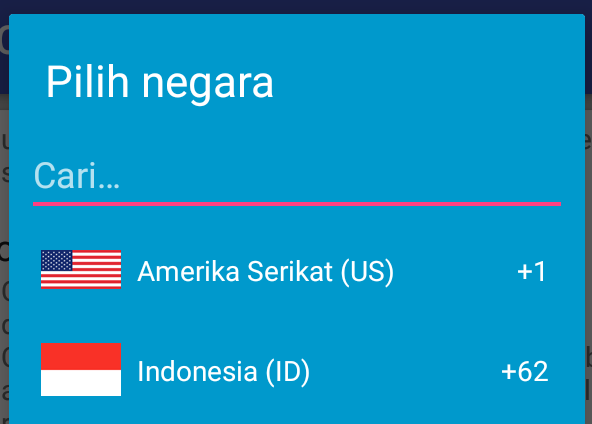

[](https://android-arsenal.com/details/1/5753)
[](https://jitpack.io/#joielechong/CountryCodePicker)

Country Code Picker Library
===========================


Country Code Picker (CCP)   is an android library which provides an easy way to search and select country phone code for the telephone number.

Introduction
------------
* CCP gives professional touch to your well designed form like login screen, sign up screen, edit profile screen.
CCP removes confusion about how to add number and thus make view more understandable. Finally reduces mistakes in user input.
 * Phone number screen without CCP
     - 

	  
* Above view can be transformed by using CCP
    - 
    
* Tapping on CCP will open a dialog to search and select country
    - 


 The most recommended usage for CCP is using the default setting so the library will auto check the all the value.
 To do that, you need to follow the following steps:
 
 1. Add CCP view to layout
 2. Add EditText view to layout
 3. register the EditText using `registerPhoneNumberTextView(editText)`
    we can also use TextView instead of editText.
 4. Let the magic happens ;)

 Here the more details steps:
 
 1. Add CCP to layout using the following:

     ````xml
     <com.rilixtech.widget.countrycodepicker.CountryCodePicker
           android:id="@+id/ccp"
           android:layout_width="wrap_content"
           android:layout_height="wrap_content" />
     ````

 2. Add EditText view to layout:

     ````xml
     <EditText
            android:id="@+id/phone_number_edt"
            android:layout_width="match_parent"
            android:layout_height="wrap_content"
            android:hint="phone"
            android:inputType="phone"/>
     ````

3. register the EditText with code:

   ```java
   CountryCodePicker ccp;
   AppCompatEditText edtPhoneNumber;

   ...

   ccp = (CountryCodePicker) findViewById(R.id.ccp);
   edtPhoneNumber = findViewById(R.id.phone_number_edt);

   ...

   ccp.registerPhoneNumberTextView(edtPhoneNumber);
   ```

4. Now look at the magic ;)


you can check validity of phone number using isValid() method.

How to add to your project
--------------

1. Add jitpack.io to your root build.gradle file:

    ````groovy
    allprojects {
        repositories {
            jcenter()
            maven { url "https://jitpack.io" }
        }
    }
    ````
2. Add library to your app build.gradle file then sync

    ````groovy
    dependencies {
        implementation 'com.github.joielechong:countrycodepicker:2.4.2'
    }
    ````

3. Add ccp view to xml layout
   
    ````xml
    <com.rilixtech.widget.countrycodepicker.CountryCodePicker
          android:id="@+id/ccp"
          android:layout_width="wrap_content"
          android:layout_height="wrap_content" />
    ````

4. Add ccp object in Activity / Fragment
    ````
    CountryCodePicker ccp;
    ````

5. Bind ccp from layout
   
    ````
    ccp = (CountryCodePicker) findViewById(R.id.ccp);
    ````

6. That's it. Run the project and see the results.
  
### For DexGuard users
If your project is obfuscated with DexGuard you may need to add the following line to the DexGuard configuration:

      -keepresourcefiles assets/io/michaelrocks/libphonenumber/android/**

This is because this library use [libphonenumber-android](https://github.com/MichaelRocks/libphonenumber-android)


Attributes
---------

Here the attributes that can be used in CountryCodePicker layout:

|   Attribute    |   method                        | Description
|---------------|---------------------------------|-------------------------------
|ccp_defaultCode | setDefaultCountryUsingPhoneCodeAndApply(int defaultCode) |  set selected Flag and phone in CCP by phone code.
|ccp_showFullName| showFullName(boolean show) | Show full name of country in CCP. Default is false|
|ccp_hideNameCode| hideNameCode(boolean hide) | Hide the country name code. Default is false|
|ccp_hidePhoneCode| hidePhoneCode(boolean hide)| Hide the phone code. Default is false|

TBD.

Features
--------

If you prefer experience along with only reads, an demo android app is available that demonstrates all the features of this library. Click below button to download from Playstore.
<br/><a href="https://play.google.com/store/apps/details?id=com.rilixtech.countrycodepicker"></a>

If you just want to read them, here you go:
 
### 1. Default country
 * Default country is the country where most of your target audience belong.
 * The default country can be set through xml layout and programmatically as well.
 
   #### A. Through xml
   ##### Using country code name
     
     Add `app:ccp_defaultNameCode="US"` (replace "US" with your default country name code) to xml layout. Refer <a href="https://goo.gl/FQjUjA">List of countries</a> for name codes.

	  ````xml
	  <com.rilixtech.widget.countrycodepicker.CountryCodePicker
	         android:id="@+id/ccp"
	         android:layout_width="wrap_content"
	         android:layout_height="wrap_content"
	         app:ccp_defaultNameCode="US"  />
	  ```` 
	      
   ##### Using phone code
     - add `app:ccp_defaultCode="81"` (replace 81 with your default country code) to xml layout.Refer <a href="https://goo.gl/FQjUjA">List of countries</a> for country codes.
     - Setting default country using phone code is not recommended. There are few cases where more than one countries have same phone code. Say US and Canada have +1. Putting '1' will result in Canada even if you were intended  for US.  `Use app:cpp_defaultNameCode` or `app:cpp_countryPreference` to overcome issue.
	
	   ````xml
	   <com.rilixtech.widget.countrycodepicker.CountryCodePicker
	         android:id="@+id/ccp"
	         android:layout_width="wrap_content"
	         android:layout_height="wrap_content"
	         app:ccp_defaultCode="81" />
	   ````
  		_`app:ccp_defaultNameCode` has higher priority than `app:ccp_defaultCode`._
  
   ####  B. Programmatically
    ##### Using country name code
      Use `setDefaultCountryUsingNameCode()` method.
   
    ##### Using phone code
    - To set default country programmatically, use ` setDefaultCountryUsingPhoneCode()` method.
    - `setDefaultCountryUsingNameCode()` or `setDefaultCountryUsingPhoneCode() ` will not set default country as selected country in CCP view. To set default country as selected country in CCP view, call `resetToDefaultCountry()` method.

    - `resetToDefaultCountry() ` will set default country as selected country in CCP, it can be used at the time of form reset.
      
    - If you do not specify default country from xml, ID +91 (Indonesia) will be the default country until you update default country programmatically.
 
### 2. Choose and set country
   Choosing and setting country will update selected country in CCP view.
   
  #### Choose Country
   1. In order to choose country, click on CCP view.
   2. Then search country by country name or phone code or name code in dialog. 
   3. Click on county from list to choose
        
  #### Set country programmatically
  **Using country code name**  
	Country in CCP can be using ```` setCountryForNameCode() ```` method.

  **Using phone code**  
   - Country in CCP can be using ```` setCountryForCode() ```` method.
   - If specified country code / name code does not match with any country, default country will be set in to CCP.
      
  **How to listen change in selection?**
    To get call back when country is changed, you need to add `OnCountryChangeListener` from code.
   ```java
   ccp.setOnCountryChangeListener(new CountryCodePicker.OnCountryChangeListener() {
		 @Override
		 public void onCountrySelected(Country selectedCountry) {
		     Toast.makeText(getContext(), "Updated " + selectedCountry.getName(), Toast.LENGTH_SHORT).show();
         }
    });
   ```
   
   
### 3. Country preference
  - Library has list of countries in alphabetical order. It searches for country in same order. But preferred country/countries have higher priority than rest.
  - There are few cases where more than one countries have same code. For example, Canada, Puerto Rico and US have +1. When lilbrary will try to find country with +1, it will always pick Canada as it's alphabetically first in (1)Canada-(2)Puerto Rico-(3)US.
  - If US is set in country preference, order for search will be (1)US-(2)Canada-(3)Puerto Rico, so it will pick US for +1.
  - Countries of preference will be listed at top in selection dialog. It is helpful when target audience is from a set of countries.
  - Any number of countries can be set in preference.
   
- #### Set through xml
  
  Add `app:ccp_countryPreference="US,ID,NZ"` (replace "US,ID,NZ" with your preference) to xml layout. Refer <a href="https://goo.gl/FQjUjA">List of countries</a> for name codes.

   ````xml
   <com.rilixtech.widget.countrycodepicker.CountryCodePicker
	         android:id="@+id/ccp"
	         android:layout_width="wrap_content"
	         android:layout_height="wrap_content"
	         app:ccp_countryPreference="US,ID,NZ"  />
   ````
   
- #### Programmatically
   Use ` setCountryPreference()` method.
        
### 4. Read selected country
    Country's 3 properties (Country name, phone code and name code) can be read individually.
    
- #### Read selected country phone code
    
   - To get selected country code as String type and without prefix “+”, use ` getSelectedCountryCode();` method. => “91”
   - To get selected country code as String type and with prefix “+”, use ` getSelectedCountryCodeWithPlus();` method. => “+91”
   - To get selected country code as int (Integer) type, use ` getSelectedCountryCodeAsInt();` method. => 91
	    
- #### Read selected country name
   To get selected country’s name, use `getSelectedCountryName();` => “Indonesia”
  
- #### Read selected country name code
   To get selected country’s name code, use `getSelectedCountryNameCode();` => “ID”
   
### 5. Full number support

  Full number is combination of country code and carrier number. for example, if country code is **91** and carrier number is **8866667722** then **918866667722** or **+918866667722** is the full number.

- #### Register phoneNumberTextView
  - `CarrierNumberEditText` is the supplementary editText in which carrier number part of full number is entered.
  - A carrierNumberEditText must be registered in order to work with full number.
  - editText can be registered using ``` registerPhoneNumberTextView()```.
  
- #### Load full number
  - To load full number, use `setFullNumber()` method. In this method you need to pass the full number.
  - Prefix “+” is optional for full number so full number can be “91886667722” or “+918866667722”. Both will set same country and carrier number."
  - This will detect country code from full number and set that county to ccp and carrier number ( remaining part of full number other than country code) will be set as text of registered carrier editText.
  - If no valid country code is found in beginning part of full number, default country will be set to CCP and full number will be set as text of registered carrier editText.
  
- #### Get full number
  - Use `getFullNumber();` for full number without “+” prefix.
  - Use `getFullNumberWithPlus();` for full number with “+” prefix.
  - A phoneNumberTextView must be registered before any function call of full number like `setFullNumber()` or `getFullNumber()`.
  - *None of the above functions validate the number format of phone.*
  
### 6. Custom text color

 Color of CCP text can be changed according to different background.
    
- #### Using XML
  Add `app:ccp_textColor` property to xml layout
   
   ````xml
   <com.rilixtech.widget.countrycodepicker.CountryCodePicker
	   android:layout_width="wrap_content"
	   android:layout_height="wrap_content"
	   app:ccp_textColor="@color/custom_color"/>
   ````
   

  You can also change the dialog text color with `ccp_dialogTextColor` attribute. It will be defaulting to your current theme text color.

- #### Programmatically
  To set color programmatically, use `setTextColor()` method.
  
   

  You can also change the dialog text color with `setDialogTextColor()` method.

### 7. Custom background color

CCP background color can be set to any custom color. It will be defaulting to application theme if not set up.

- #### Using XML

  Add `app:ccp_backgroundColor` property to xml layout

   ````xml
   <com.rilixtech.widget.countrycodepicker.CountryCodePicker
	   android:layout_width="wrap_content"
	   android:layout_height="wrap_content"
	   app:ccp_backgroundColor="@color/custom_color"/>
   ````
   

- #### Programmatically
  To set color programmatically, use `setBackgroundColor()` method.

  

### 8. Custom textSize

   - Text size of CCP content can be changed in order to match rest of the view of form.
   - Everytime when textSize is updated, arrowsize will be updated itself. 
     

- #### Using XML
  Add app:ccp_textSize property to xml layout

   ````xml
    <com.rilixtech.widget.countrycodepicker.CountryCodePicker
	          android:layout_width="wrap_content"
	          android:layout_height="wrap_content"
	          app:ccp_textSize="26sp"/>
   ````

- #### Programmatically
   To set `textSize` programmatically, use `setTextSize()` method.
   
   
### 9. Custom arrow size
  Size if Down arrow of CCP view can be modified in order to match rest of the view of form.
    
- #### Using XML
  Add `app:ccp_arrowSize` property to xml layout
	      
   ````xml
   <com.rilixtech.widget.countrycodepicker.CountryCodePicker
	     android:layout_width="wrap_content"
	     android:layout_height="wrap_content"
	     app:ccp_arrowSize="26sp"/>
   ````

-  #### Programmatically
  To set arrow size programmatically, use ```` setArrowSize() ```` method.
 
### 10. Hide country name code

  By default, text of CCP contains country's name code. i.e "(US) +1". Country name code can be removed if required.
    
- #### Using XML
  Add `app:ccp_hideCodeName` property to xml layout
	      
   ````xml
   <com.rilixtech.widget.countrycodepicker.CountryCodePicker
	     android:layout_width="wrap_content"
	     android:layout_height="wrap_content"
	     app:ccp_hideNameCode="true"/>
   ````

-  #### Programmatically
   To hide name code programmatically, use ```` hideNameCode() ```` method.
  
### 11. Custom master country list
  - If your app expects users from only few countries then you might wish to remove all other countries from selection list.
  - You can remove unnecessary countries by setting your custom master country list.
  - Also it will keep user from selecting irrelevant country.
  - Countries of preference will be listed at top in selection dialog. It is helpful when target audience is from a set of countries.
  - Custom master list will only limit the visibility of irrelevant countries from selection dialog. But all other functions like `setCountryForCodeName()` or `setFullNumber()` will consider all the countries.
  - Preferred country list will be a subset of custom master list. If some xyz country is not in custom master list, it won't be added to preferred country list.
   
- #### Set through xml

  Add `app:ccp_customMasterCountries="US,ID,NZ,BD,PL,RO,ZW"` (replace "US,ID,NZ,BD,PL,RO,ZW" by your own country code names) to xml layout. Refer <a href="https://goo.gl/FQjUjA">List of countries</a> for name codes.

   ````xml
   <com.rilixtech.widget.countrycodepicker.CountryCodePicker
	      android:id="@+id/ccp"
	      android:layout_width="wrap_content"
	      android:layout_height="wrap_content"
	      app:ccp_customMasterCountries="US,IN,NZ,BD,PL,RO,ZW"  />
   ````
  
- #### Programmatically 
  - Use `setCustomMasterCountries()` method. 
  - `setCustomMasterCountries(null)` will remove custom list and revert to library default list.

  
### 12. Custom font

  FontFamily of CCP content can be changed in order to match rest of the view of form.
    

- #### For programmatically and xml
  Do the following step first:
  
   - Step 1:
     Create a folder named ***assets*** under **app/src/main/** folder. If you already have **app/src/main/assets** then jump to next step.
   - Step 2:
     Put your font's .ttf file in assets folder. For example if file name is ***myfonts.ttf***, it should be **app/src/main/assets/myfonts.ttf**. Make sure that the extension '.ttf' have contain small letters only. '.TTF' will not work.

- #### Programmatically
  - Step 1:
    Now prepare typeFace using `Typeface typeFace=Typeface.createFromAsset(getContext().getAssets(),"myfonts.ttf");`
  - Step 2: 
    Finally apply the type face on ccp `ccp.setTypeFace(typeFace);` OR ` ccp.setTypeFace(typeFace,customStyle);`

- #### Set through xml
  Add `app:ccp_textFont="myfonts.ttf"` to use the font

   ````xml
   <com.rilixtech.widget.countrycodepicker.CountryCodePicker
       	 android:id="@+id/ccp"
       	 android:layout_width="wrap_content"
         android:layout_height="wrap_content"
       	 app:ccp_textFont="myfonts.ttf" />
   ````
   
### 13. National Flag Thumbnail
 
 - Added flag thumbnail to cpp and selector dialog
 - More thumbnail packs can be added
 - By default flag will be added to the ccp view
 
- #### Set through xml
 Add `app:ccp_showFlag="false"` to remove flag using xml layout

   ````xml
   <com.rilixtech.widget.countrycodepicker.CountryCodePicker
          android:id="@+id/ccp"
          android:layout_width="wrap_content"
          android:layout_height="wrap_content"
          app:ccp_showFlag="false" />
   ````

- #### Programmatically
  Use `showFlag(false)` method to hide the flag.

### 14. Show Full Country Name
 
 - Developer might wish to show full country name instead of only code name
 - `showFullName` will replace name code with full name.
 - If name code was hidden using app:hideNameCode="true" then this will not work.
 - Some country names are real long so go for this option only if your UI has dedicated enough space for it.
  

- #### Set through xml
  Add `app:ccp_showFullName="true"` to show full nameinstead of name code

   ````xml
   <com.rilixtech.widget.countrycodepicker.CountryCodePicker
          android:id="@+id/ccp"
          android:layout_width="wrap_content"
          android:layout_height="wrap_content"
          app:ccp_showFullName="true"/>
   ````

- #### Programmatically
  Use `showFullName(true)` or `showFullName(false)` method to show / hide the full name.
  
  
### 15. Enable / Disable click
 
 Developer can toggle click listener of CCP
 
- #### Set through xml
  Add `app:ccp_clickable="true"` to enable click listener.

   ````xml
   <com.rilixtech.CountryCodePicker
          android:id="@+id/ccp"
          android:layout_width="wrap_content"
          android:layout_height="wrap_content"
          app:ccp_clickable="false"/>
   ````

- #### Programmatically
   Use ` setClickable(true)` or ` setClickable(false)` method to enable / disable the click.

### 16. Hide / Show Phone Code
 The phone code can be hide or show if you want. By default the phone code is shown. We don't need to add the attribute to show the phone code.
 
- #### Set through xml
  Add `app:ccp_hidePhoneCode="true"` to hide the phone code.

   ````xml
   <com.rilixtech.widget.countrycodepicker.CountryCodePicker
          android:id="@+id/ccp"
          android:layout_width="wrap_content"
          android:layout_height="wrap_content"
          app:ccp_hidePhoneCode="true"/>
   ````

- #### Programmatically
   Use ` setHidePhoneCode(true)` or ` setHidePhoneCode(false)` method to hide / show the phone code.


### 17. Enable / Disable Auto Formatter

You need to set an EditText for phone number with `registerPhoneNumberTextView()` to make use of this.
 Ignore this if you don't.
 The auto formatter for EditText can be enable/disable by using `enablePhoneAutoFormatter` attribute. By default, auto formatter is enabled.
 
- #### Set through xml
   Add `app:ccp_enablePhoneAutoFormatter="false"` to disable.

      ````xml
      <com.rilixtech.CountryCodePicker
             android:id="@+id/ccp"
             android:layout_width="wrap_content"
             android:layout_height="wrap_content"
             app:ccp_enablePhoneAutoFormatter="false"/>
      ````

- #### Programmatically
   Use `enablePhoneAutoFormatter(true)` or `enablePhoneAutoFormatter(false)` method to enable / disable auto formatter.

   To check for it, use `isPhoneAutoFormatterEnabled()`

### 18. Enable / Disable Set Country Code By TimeZone

You need to set an EditText for phone number with `registerPhoneNumberTextView()` to make use of this.
 Ignore this if you don't.
 By default, CCP will checking for country code from time zone if no default country code set and no country code is found from device network.
 The default value is true.

 Use `ccp_setCountryByTimeZone` attribute to change.
 This attribute is having the least order from defaultNameCode. Here the order CCP use:
 1. defaultNameCode by using `ccp_defaultNameCode`
 2. Auto detect from device by checking network
 3. time zone from device by using `ccp_setCountryByTimeZone`
 4. country iso from device locale.
 5. the last default will be defaulting to country code ID (Indonesia).

- #### Set through xml
   Add `app:ccp_setCountryByTimeZone="false"` to disable.

      ````xml
      <com.rilixtech.widget.countrycodepicker.CountryCodePicker
             android:id="@+id/ccp"
             android:layout_width="wrap_content"
             android:layout_height="wrap_content"
             app:ccp_setCountryByTimeZone="false"/>
      ````

- #### Programmatically
   Use `enableSetCountryByTimeZone(true)` or `enableSetCountryByTimeZone(false)` method to enable / disable time zone.

   To check for it, use `isPhoneAutoFormatterEnabled()`

## Thanks for the Contributors
[Tejas N A](https://github.com/tejasna) for the PR.
[sadegh] (https://github.com/sadeghpro) for the PR.

## Credits

Michael Rozumyanskiy for [libphonenumber-android](https://github.com/MichaelRocks/libphonenumber-android)

Harsh Bhakta for the original project at [CountryCodePickerProject](https://github.com/hbb20/CountryCodePickerProject)

[egek92](https://github.com/egek92) for Turkish translation.

## License

[Apache Version 2.0](http://www.apache.org/licenses/LICENSE-2.0.html)

    Copyright (C) 2019 Joielechong

    Copyright (C) 2016 Harsh Bhakta

    Licensed under the Apache License, Version 2.0 (the "License");
    you may not use this file except in compliance with the License.
    You may obtain a copy of the License at

       http://www.apache.org/licenses/LICENSE-2.0

    Unless required by applicable law or agreed to in writing, software
    distributed under the License is distributed on an "AS IS" BASIS,
    WITHOUT WARRANTIES OR CONDITIONS OF ANY KIND, either express or implied.
    See the License for the specific language governing permissions and
    limitations under the License.
